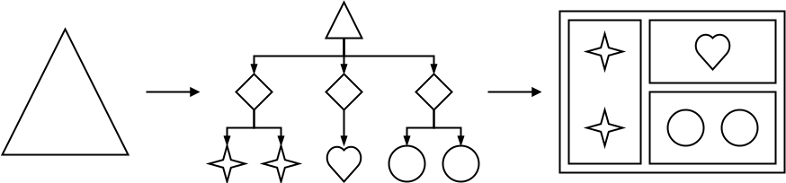
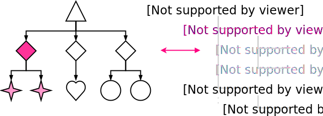

title: React Trainging
author:
  name: Pawel Wieladek
  twitter: pawelwieladek
  url: http://pawelwieladek.com
style: public/style.css
output: public/index.html
controls: false
progress: true

---

# React Training


---

# Part 1. ES6


---

### Variables

```js
// hoisted
var a;
```
```js
// block-scoped
let b;
```
```js
// block-scoped
const b;
```

---

### Objects

```js
let name = 'Pawel';

// ES5
var you = {
    name: name
};

// ES6
let me = {
    name
};
```

#### Methods

```js
// ES5
var you = {
    sayHello: function(name) {
        return 'Hello, ' + name + '!';
    }
};

// ES6
let me = {
    sayHello(name) {
        return `Hi, ${name}!`;
    }
};
```

#### Getter

```js
let me = {
    firstName: 'Pawel',
    lastName: 'Wieladek',
    get name() {
        return `${this.firstName} ${this.lastName}`;
    }
};

console.log(me.name);
// Pawel Wieladek
```

#### Setter

```js
let me = {
    counter: 0,
    firstName: 'Pawel',
    lastName: 'Wieladek',
    get greeting() {
        return `Hello, I'm ${this.firstName} ${this.lastName}`;
    },
    set name(value) {
        this.firstName = value;
        this.counter++;
    }
};

me.name = 'Pablo';

console.log(me.greeting);
// Hello, I'm Pablo Wieladek!

console.log(me.counter);
// 1
```

#### Computed property names

```js
// ES5
function createIconClassNames(name, size) {
    var classNames = {};
    classNames['icon-' + name] = !!name;
    classNames['icon-' + size] = !!size;
    return classNames;
}

// ES6
function createIconClassNames(name, size) {
    return {
        [`icon-${name}`]: !!name,
        [`icon-${size}`]: !!size
    };
}

let iconClassNames = createIconClassNames('square', 'large');

console.log(iconClassNames);
// { 'icon-square': true, 'icon-large': true }
```

---

### Destructuring

#### List matching
```js
var [a, b, c] = [1, 2, 3, 4];

console.log(a);
// 1;
console.log(b);
// 2;
console.log(c);
// 3;
```

```js
let [a, , c] = [1, 2, 3, 4];

console.log(a);
// 1;
console.log(c);
// 3;
```

#### Object matching

```js
function createPerson() {
    return {
        firstName: 'Pawel',
        lastName: 'Wieladek'
    };
}

// later on...

let { firstName, lastName } = createPerson();

console.log(firstName);
// Pawel
console.log(lastName);
// Wieladek
```

```js
let { firstName: f, lastName: l } = createPerson();

console.log(f);
// Pawel
console.log(l);
// Wieladek
```

```js
let response = {
    status: 400,
    errors: [
        {
            text: 'Bad Request',
            stack: '...'
        }
    ]
};

let { status, errors: [ { text: message } ] } = response;

console.log(status);
// 400
console.log({ message });
// { message: 'Bad request' }
```

#### Destructuring in function argument

```js
function sayHello({ first, last }) {
    // first and last are variables from now
    return `Hello, I'm ${first} ${last}!`;
}

let greeting = sayHello({
    first: 'Pawel',
    last: 'Wieladek'
});

console.log(greeting);
// Hi, I'm Pawel Wieladek!
```

---

### Function arguments

#### Default parameters

```js
function multiply(a, b = 1) {
    return a * b;
}

console.log(multiply(5));
// 5
console.log(multiply(2, 3));
// 6
```

#### Rest parameters

```js
function append(a, ...b) {
    // b is an Array
    return a + ', ' + b.join(', ');
}

console.log(append('apple', 'orange', 'plum', 'kiwi'));
// apple, orange, plum, kiwi
```

#### Spread operator

```js
function add(x, y, z) {
  return x + y + z;
}

let a = [1, 2, 3];
console.log(add(...a));
// 6

let b = [
    ...a,
    4,
    5
];
console.log(b);
// 1, 2, 3, 4, 5
```

---

### Arrow function

#### Single argument

```js
[1, 2, 3, 4].map(x => x * 2);    

// [2, 4, 6, 8]
```

#### Multiple arguments

```js
['a', 'b', 'c', 'd'].map((value, index) => {
    index = index + 1;
    return [index, value];
});

// [[1, 'a'], [2, 'b'], [3, 'c'], [4, 'd']]
```

#### Multiple arguments with destructuring

```js
[[1, 'a'], [2, 'b'], [3, 'c'], [4, 'd']].map(([index, value]) => {
    return {
        [value]: index
    };
});

// [ { a: 1 }, { b: 2 }, { c: 3 }, { d: 4 } ]
```

#### ```this``` autobinding

```js
// ES5
function AsyncCounter(initialValue) {
    this.value = initialValue;
}

AsyncCounter.prototype.increment = function() {
    setTimeout(function() {
        this.value++;
    }.bind(this), 100);
};

// ES6
class AsyncCounter {
    constructor(initialValue) {
        this.value = initialValue;
    }

    increment() {
        setTimeout(() => {
            // `this` is bound to the value of current context
            this.value++;
        }, 100);
    }
}
```

---

### Classes

#### Base class

```js
class Point {
    constructor(x, y) {
        this.x = x;
        this.y = y;
    }

    toString() {
        return `x = ${this.x}, y = ${this.y}`;
    }
}

let p = new Point(3, 4);

console.log(p.toString());      
// x = 3, y = 4

// toString overridden
console.log('' + p);            
// x = 3, y = 4

console.log(`${p}`);            
// x = 3, y = 4
```

#### Derived class

```js
class ColorPoint extends Point {
    constructor(x, y, color) {
        super(x, y);
        this.color = color;
    }

    static createDefault() {
        return new ColorPoint(0, 0, 'black');
    }

    toString() {
        return `${super.toString()}, color = ${this.color}`;
    }
}

let p = new ColorPoint(2, 3, 'red');

console.log(p.toString());      
// x = 2, y = 3, color = red

let q = ColorPoint.createDefault();

console.log(q.toString());      
// x = 0, y = 0, color = black
```

---

### Modules

#### Default export

```js
// square.js

export default function square(x) {
    return x * x;
}
```

```js
// main.js

import sq from './square';

console.log(sq(8));
// 64
```

#### Named export

```js
// lib.js

export const PI = 3.14;

export function square(x) {
    return x * x;
}

export class Circle {
    constructor(x, y, r) {
        this.x = x;
        this.y = y;
        this.r = r;
    }
}
```

```js
// main.js

import { square, PI, Circle } from './lib';

console.log(PI);
// 3.14
console.log(square(8));
// 64
console.log(new Circle(3, 4, 5));
// { x: 3, y: 4, r: 5 }
```

```js
// main.js

import * as lib from './lib';

console.log(lib.PI);
// 3.14
console.log(lib.square(8));
// 64
```

---

# Part 2. React


---

### Hello, World!

```html
<div id="root"></div>
```

```js
import ReactDOM from 'react-dom';

ReactDOM.render(
  <h1>Hello, world!</h1>,
  document.getElementById('root')
);
```

---

### JSX syntax

```js
const element = <h1 className="greeting">Hello, world!</h1>;
```

```js
const element = React.createElement(
  'h1',
  { className: 'greeting' },
  'Hello, world!'
);
```

#### Separation of conerns
Separate logic units instead of technologies.

@todo: obrazek

#### JSX is a function call
```js
const element = <h1>Hello, world!</h1>;
```

```js
// preact example
const element = h('h1', 'Hello, world!');
```

#### Attributes

##### string

```html
<div className="container"><div>
```

##### boolean

```html
<button disabled></button>
// default true
<button disabled={false}></button>
```

##### number

```html
<textarea cols={6}></textarea>
```

##### function

```html
<input onChange={this.handleChange} />
```

##### any JS expression

```html
<input value={2+2} />
```

##### self-closing tag

```html
<input type="text" />
```

##### children

```html
<div>
  <p>Paragraph 1</p>
  <p>Paragraph 2</p>
</div>
```

##### spread operator

```js
const props = {
  title,
  onClick
};

const foo1 = <Component {...props} />
// is equal to
const foo2 = <Component title={title} onClick={onClick} />
```

#### JSX Prevents Injection Attacks
By default, React DOM escapes any values embedded in JSX before rendering them.

```html
<Header greeting={'<3'} />
```
is equal to
```html
<Header greeting="&lt;3" />
```

#### Expression as children

```html
<ul>
  {items.map((item) => <li key={item}>{item}</li>)}
</ul>
```

#### Function as children

```html
<ul>
  <Repeat times={3}>
    {(index) => <li key={index}>{index}</li>}
  </Repeat>
</ul>
```

#### Booleans, Null, and Undefined are ignored

```html
<div />
<div></div>
<div>{false}</div>
<div>{null}</div>
<div>{undefined}</div>
<div>{true}</div>
```

---

### Props

```props``` are **input data**.

```props``` are **read-only**.

#### Component as a class

```js
class Header extends React.Component {
  render() {
    return <h1>Hello, {this.props.name}!</h1>;
  }
}
```

#### Component as a function

```js
function Header(props) {
  return <h1>Hello, {props.name}!</h1>;
}
```

#### Extraction

Split large piece of functionality into smaller components.



---

### State

Component must act like a **pure function**.

UI is dynamic and **changes over time**.

Component can have its own **state** to reflect the changes.

Component **change state only by** ```setState()``` function

```js
class Counter extends React.Component {
  constructor(props) {
    super(props);
    this.increment = this.increment.bind(this);
    this.state = {
        count: 5
    };
  }

  increment() {
    this.setState({
        count: this.state.count + 1
    });
  }

  render() {
    return (
        <button onClick={this.increment}>{this.state.count}</button>
    );
  }
});
```

#### Binding

```js
this.increment = this.increment.bind(this);
```

#### The smallest representaion possible

```js
// bad practice
this.setState({
  firstName: firstName,
  lastName: lastName,
  fullName: `${firstName} ${lastName}`
});

// instead modify in render
render() {
  let fullName = `${firstName} ${lastName}`;
  return (
    <div>{fullName}</div>
  );
}
```

---

### Events

```SyntheticEvent``` for cross-browser compatibility.

```js
class Input extends React.Component {
  constructor(props) {
    super(props);
    this.handleChange = this.handleChange.bind(this);
  }

  handleChange(event) {
    // event is not plain JS Event, but React SyntheticEvent
    this.props.onChange(event.target.value);
  }

  render() {
    return (
      <input
        value={this.props.value}
        onChange={this.handleChange}
      />
    );
  }
}
```

--- 

### Data flow

```js
class Input extends React.Component {
  constructor(props) {
    super(props);
    this.handleChange = this.handleChange.bind(this);
  }

  handleChange(event) {
    this.props.onChange(event.target.value);
  }

  render() {
    return (
      <input
        value={this.props.value}
        onChange={this.handleChange}
      />
    );
  }
}
```

```js
class Header extends React.Component {
  constructor(props) {
    super(props);
    this.handleChange = this.handleChange.bind(this);
    this.state = {
      name: 'world'
    };
  }

  handleChange(name) {
    this.setState({ handleChange });
  }

  render() {
    return (
      <div>
        <Input value={name} onChange={this.handleChange} />
        <h1>Hello, {name}!</h1>
      </div>
    );
  }
}
```

---

### Virtual DOM

Instead of manipulating DOM tree, React implements it's own **tree of components**

React compares two component trees, finds changes and apply them on the DOM.



---

### Lifecycle

```js
class Header extends React.Component {
  constructor(props) {
    super(props);
    // initial state
    this.state = {};
  }

  static defaultProps = {
    greeting: 'Hello'
  }

  static displayName = 'Header';

  render() {
    return <h1>Hello, world!</h1>;
  }
}
```

> Tip: [transform-class-properties](https://babeljs.io/docs/plugins/transform-class-properties/) lets you use ```static``` keyword.

#### Mounting

1. ```constructor()```
2. ```componentWillMount()```
3. ```render()```
4. ```componentDidMount()```

#### Updating

1. ```componentWillReceiveProps()```
2. ```shouldComponentUpdate()```
3. ```componentWillUpdate()```
4. ```render()```
5. ```componentDidUpdate()```

#### Unmounting

1. ```componentWillUnmount()```

---

### Conditional Rendering

```js
class Header extends React.Component {
  constructor(props) {
    super(props);
    this.showLine = this.showLine.bind(this);
    this.state = {
      lineVisible: false
    };
  }

  showLine() {
    this.setState({
      lineVisible: true
    });
  }

  renderLine() {
    if (this.state.formEnabled) {
      return <hr />;
    }
  }

  render() {
    let line = this.renderLine();
    return (
      <div>
        <button onClick={this.showLine}>Show line</button>
        {line}
      </div>
    );
  }
}
```

---

### Lists

```js
class Header extends React.Component {
  render() {
    return (
      <ul>
        {this.props.items.map(item => {
          return <li key={item.id}>{item.text}</li>;
        })}
      </ul>
    );
  }
}
```

#### Keys

Keys help React identify which items have changed.

Key has to be unique for the item among its siblings.

```js
// bad practice
<ul>
  {items.map((item, index) =>
    <li key={index}>{item.text}</li>
  )}
</ul>
```

---

### Composition

```js
class Input extends React.Component {
  constructor(props) {
    super(props);
    this.handleChange = this.handleChange.bind(this);
  }

  handleChange(event) {
    // encapsulate <input> specific data structure
    this.props.onChange(event.target.value);
  }

  render() {
    return (
      <input
        value={this.props.value}
        onChange={this.handleChange}
      />
    );
  }
}
```

```js
class Button extends React.Component {
  render() {
    const largeClassName = this.props.size === 'large' ? 'btn-large' : null;
    const buttonClassNames = classNames('btn', largeClassName);
    return (
      <button className={buttonClassNames}>{this.props.children}</button>
    );
  }
}

class LargeButton extends React.Component {
  render() {
    return (
      <Button {...props} size="large" />
    );
  }
}
```

---

### Prop Types

Define component's API and validate input data.

```js
import PropTypes from 'prop-types';

class Header extends React.Component {
  static propTypes = {
    name: PropTypes.string.isRequired,
    onClick: PropTypes.func
  }

  static defaultProps = {
    return {
      onClick: () => {}
    };
  }

  render() {
    return (
      <div>
        <h1>Hello, {this.props.name}!</h1>
        <button onClick={this.props.onClick}>Click me</button>
      </div>
    );
  }
}
```

---

### Refs

Typically to modify a child, you **re-render it with new props**. 

**refs** gives an access to a DOM node.

```js
class Input extends React.Component {
  componentDidMount() {
    // once component is mounted, DOM node is present
    const domNode = ReactDOM.findDOMNode(this.refs.input);
    $.fancyPlugin(domNode);
  }

  render() {
    return (
      <input type="text" ref="input" />
    );
  }
}
```

---

### Style and classes

```js
class Header extends React.Component {
  render() {
    return (
      <button className="btn btn-primary" style={{
        color: 'red',
        padding: 20
      }}>
        Hello, world!
      </button>
    );
  }
}
```

---

### Fragments

A common pattern in React is for a component to **return multiple elements**.

Fragments let you **group a list of children without adding extra nodes** to the DOM.

```js
function ParametersList(props) {
  return (
    <dl>
      {props.parameters.map(parameter => (
        <React.Fragment key={parameter.id}>
          <dt>{parameter.name}</dt>
          <dd>{parameter.value}</dd>
        </React.Fragment>
      ))}
    </dl>
  );
}
```

---

### Context

Context lets the data pass through the component tree **implicitly**

#### Passing data without context

```js
class A extends React.Component {
  render() {
    return (
      <button style={{ background: this.props.background }}>
        Click me
      </button>
    );
  }
}
```

```js
class B extends React.Component {
  render() {
    return (
      <A background={this.props.background} />
    );
  }
}
```

```js
class C extends React.Component {
  render() {
    return (
      <B background={this.props.background} />
    );
  }
}
```

```js
class D extends React.Component {
  render() {
    return (
      <C background="f00" />
    );
  }
}
```

#### Passing data with context

```js
class A extends React.Component {
  static contextTypes = {
    background: PropTypes.string
  };

  render() {
    return (
      <button style={{ background: this.props.background }}>
        Click me
      </button>
    );
  }
}
```

```js
class B extends React.Component {
  render() {
    return (
      <A />
    );
  }
}
```

```js
class C extends React.Component {
  render() {
    return (
      <B />
    );
  }
}
```

```js
class D extends React.Component {
  static childContextTypes = {
    background: PropTypes.string
  };

  getChildContext() {
    return { background: "f00" };
  }

  render() {
    return (
      <C />
    );
  }
}
```

---

### Higher-Order Components

Higher-order component is a &&function that takes a component and returns a **new component**.

```js
const EnhancedComponent = higherOrderComponent(WrappedComponent);
```

Example

```js
function withLoader(WrappedComponent) {
  class WithLoader extends React.Component {
    render() {
      // pass all props with spread operator
      return this.props.loaded ? (
        <WrappedComponent {...this.props} />
      ) : <div className="loader" />;
    }
  }
  // override displayName to indicate HoC usage
  const displayName = WrappedComponent.displayName ||
    WrappedComponent.name ||
    'Component';
  WithLoader.displayName = `WithLoader(${displayName})`;
  // return new component
  return WithLoader;
}
```

```js
@withLoader
class Welcome extends React.Component {
  render() {
    return (
      <h1>Hello, {this.props.name}!</h1>
    );
  }
}
```

```js
class App extends React.Component {
  render() {
    return (
      <div>
        <Welcome loaded={false} name="Pawel" />
        <Welcome loaded={true} name="Pawel" />
      </div>
    );
  }
}
```

---

### Server-side Rendering

---

### Testing
